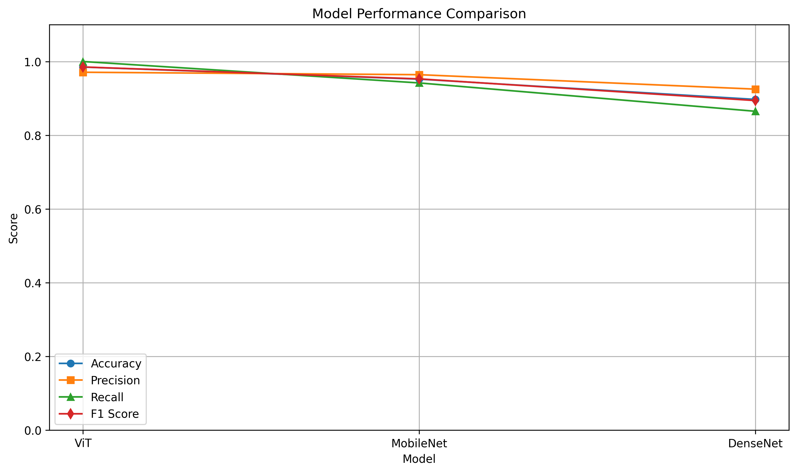

# 🎭 Deepfake Detection using MobileNet, ViT, and DenseNet

This project is a deep learning-based deepfake detection system that identifies manipulated videos using RGB face crops extracted from `.mp4` video files. It compares the performance of three models — **MobileNet**, **Vision Transformer (ViT)**, and **DenseNet with LSTM** — trained and evaluated on real vs. fake videos.

---

## 📂 Project Structure

deepfake-detection/
├── deepfake_pipeline.ipynb # Full training and evaluation pipeline
├── requirements.txt # Python dependencies
├── LICENSE # MIT License
├── README.md # Project overview
├── results/ # Final prediction CSVs
│ ├── mobilenet_real_mp4.csv
│ ├── mobilenet_fake_mp4.csv
│ ├── ViT_real_classification_results.csv
│ ├── ViT_fake_classification_results.csv
│ └── densenet_results.csv
│ └── model_comparison.png

---

## 📊 Model Comparison

| Model       | Accuracy | Precision | Recall  | F1 Score | AUC-ROC |
|-------------|----------|-----------|---------|----------|---------|
| **ViT**     | 0.9850   | 0.9709    | 1.0000  | 0.9852   | 0.5469  |
| **MobileNet** | 0.9522 | 0.9643    | 0.9419  | 0.9529   | 0.9867  |
| **DenseNet + LSTM** | 0.8972 | 0.9251 | 0.8650 | 0.8941   | —       |

✅ All models were trained on **RGB face crops** extracted from videos  
✅ Testing was performed on **original `.mp4` videos** (on-the-fly face detection)

---

## 🧪 How It Works

1. **Face Extraction**: Extracts RGB face crops from video frames using MTCNN or OpenCV
2. **Training**:
   - CNN models trained on pre-extracted face images (`real/` and `fake/`)
3. **Testing**:
   - On-the-fly frame extraction and face detection from `.mp4` videos
   - Predictions stored with confidence and correctness per video
4. **Evaluation**:
   - Accuracy, Precision, Recall, F1, and AUC-ROC calculated
   - Results saved to CSVs

---

## 📈 Visual Results

## 📌 Model performance comparison  
> Shows Accuracy, Precision, Recall, and F1 Score for MobileNet, ViT, and DenseNet.

<!-- Optional placeholder if you add it later -->
<p align="center">
  
</p>


---

## 🛠️ Dependencies

Install requirements using:

```bash
pip install -r requirements.txt
```
📁 Dataset
The dataset is a subset of the FaceForensics++ dataset and includes:

real/: 200 real videos

fake/: 200 manipulated videos (FaceSwap, Face2Face, NeuralTextures, etc.)

⚠️ Due to size constraints, videos and extracted images are not included in this repo.

📝 License
This project is licensed under the MIT License.

🙋‍♀️ Author
Vandhana S
🎓 B.Tech AI & DS @ SASTRA University
🌐 LinkedIn: www.linkedin.com/in/vandhana-shanmugam-2460v1301
📫 Contact: svandhana246@gmail.com

